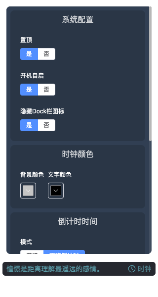

<p align="center">
  
</p>
<p align="center">
    <a href="https://github.com/KassyTan95/FlipClock/blob/master/LICENSE" target="_blank">
    <a href=""></a>
    </a>
</p>

# 翻转时钟

**桌面翻页时钟 + 倒计时**

**欢迎Star 🌟🌟🌟, 如果遇到问题或建议请提Issue**

## 技术栈

- [Electron](https://www.electronjs.org/) + [TypeScript](www.typescriptlang.org) + [Vue3](https://cn.vuejs.org/) + [Vite](https://vitejs.dev/) + [Pinia](https://pinia.vuejs.org/) + [TailwindCSS](https://tailwindcss.com/)

## 推荐 IDE 设置

- [VSCode](https://code.visualstudio.com/) + [ESLint](https://marketplace.visualstudio.com/items?itemName=dbaeumer.vscode-eslint) + [Prettier](https://marketplace.visualstudio.com/items?itemName=esbenp.prettier-vscode)

## 项目初始化

### 安装

```bash
$ pnpm install
```

### 启动

```bash
$ pnpm dev
```

### 编译

```bash
# For windows
$ pnpm build:win

# For macOS
$ pnpm build:mac

# For Linux
$ pnpm build:linux
```

## 演示





## 致谢
> 感谢[一言](https://hitokoto.cn/)提供的免费接口
